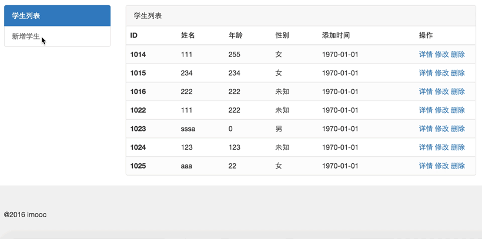

# LaravelForm笔记

## Controller介绍
#### 一、Request请求
路径: StudentController文件下的request1方法

> 1、查看url是否拥有某个参数
```
$request->has('xxx');
```
> 2、查看所有的request请求数据
```
$request->all();
```
> 3、判断请求类型
```
$request->method();         //获取请求的方法
$request->isMethod('get');  //判断是否是get请求
$request->isMethod('post'); //判断是否是post请求
$request->ajax();           //判断是否是ajax请求
```
> 4、判断是否是属于某个控制器
```
// 路由修改为student/xx后为true,http://localhost:55/LaravelForm/public/student/request1?name=mmm&aa=11

$request->is('student/*');
```

> 5、查看当前的URL路径
```
$request->url()
```

#### 二、Session
* 1、Session简介
    * 由于HTTP协议是无状态的(Stateles), 所以session提供一种保存用户数据的方法
    * Laravel支持多种session后端驱动,也支持内置支持如: Memcached、Redis和数据库的后端驱动。
    默认使用"file"的Session驱动
    * session的配置文件配置在 `config/session.php`中
* 2、Laravel中使用session三种方式
    * HTTP request类的session()方法
    * session()辅助函数
    * Session facade

    ```
    // 1、HTTP request session() 存取
    $request->session()->put('key1', 'value1');
    dd($request->session()->get('key1'));

    // 2、session辅助方法
    session()->put('key3', 'value');
    dd(session()->get('key3'));

    // 3、Session
    Session::put('key3', 'vvv'); // 存储数据到Session
    dd(Session::get('key3', '默认显示空值'));

    // 4、Session以数组形式存取
    Session::put(['key4' => '444']);
    dd(Session::get('key4'));

    // 5、把数据放到Session的数组中
    Session::push('student', '444');
    Session::push('student', '555');
    // var_dump(Session::get('student'));

    // 6、用pull取出数据并删除该条, 之后为null
    var_dump(Session::pull('student', '555'));

    // 7、判断key是否存在
    Session::has('key1');

    // 8、获取Session所有值
    Session::all();

    // 9、forget删除某个key-value键值对
    Session::forget('key1');

    // 10、清空所有session信息
    Session::flush();

    // 11、暂存数据,即只有第一次访问有效
    Session::flash('key-flash', 'value-flash');
    Session::get('key-flash');
    ```
#### 三、Response
* 1、响应的常见类型
    * 字符串
    * 视图
    * Json
    * 重定向
```
// 1、响应json
$data = [
    'errCode' => 0,
    'errMsg' => 'success',
    'data' => 'sean',
];
return response()->json($data);

// 2、重定向
return redirect('session2');

// 3、重定向中传值(get第一次访问才能出现该值)
return redirect('session2')->with('msg', '我是快闪数据');

// 4、重定向中间键action()
return redirect()->action('StudentController@session2')->with('msg', '我是快闪数据');

// 5、重定向中间键route()
return redirect()->route('session2')->with('message', '我是快闪数据');

// 6、由重定向返回上一页面
return redirect()->back();
```
#### 四、Middleware
在app/Http/Middleware目录下新建中间件.

* 1、中间件的作用
过滤进入应用程序的HTTP请求.

* 2、场景举例：
有一个活动，在指定日期后开始，如果活动没开始，只能访问宣传页面.
```
// 对应活动的宣传页面
public function activity0() {
    return '活动快要开始了, 敬请期待!';
}
// 对应活动的页面1
public function activity1() {
    return '活动进行中, 谢谢您的参与1!';
}
// 对应活动的页面2
public function activity2() {
    return '活动进行中, 谢谢您的参与2!';
}
```
    * 新建中间件
    在App\Http\Middleware目录下新建中间件`Activity.php`
    ```
    // 在
    <?php
    namespace App\Http\Middleware;
    use Closure;

    // 活动Activity中间件
    // --> 对应的是在App\Http下的Kernel.php中注册该中间件
    class Activity {
        public function handle($request, Closure $next) { // 前置判断
            if(time() < strtotime('2016-11-15')) { // 小于2016-11-15重定向到路由activity0
                return redirect('activity0');
            }
            return $next($request);
        }
    }

    ```
    * 注册中间件.

    // 上面Activity中间件 --> 对应的是在App\Http下的Kernel.php中的`$routeMiddleware`方法注册该中间件
    ```
    // 在该方法中添加以下键值对
    'activity' => \App\Http\Middleware\Activity::class,
    ```
    * 使用中间件.

    在routes.php路由中
    ```
    // 宣传页面
    Route::get('activity0', 'StudentController@activity0');
    // 要经过中间件过滤的activity~
    Route::group(['middleware' => ['activity']], function() {
        Route::get('activity1', 'StudentController@activity1');
        Route::get('activity2', 'StudentController@activity2');
    });
    ```
    * 中间件的前置和后置操作

## 玩转Laravel表单
* 1、案例演示
* 2、静态资源管理及模板布局

将jquery和bootstrap静态资源放在public目录下.
* 3、表单列表及分页实现

// 1、XXXController控制中
```
XXXModel::paginate(4); // 分页，每页4条

```
// 2、view中渲染
```
{{ $students->render() }}
```
* 4、通过表单实现新增及操作状态提示功能
  * a、通过表单实现模型新增和create新增
    * 在模板中添加各个input的name属性，如：`name="Student[age]"`
  * b、提交到当前方法和指定方法
    * 在控制器中`$data = $request->input('Student');`获取模板中的输入值
    * 1、form表单中`action="{{ url('student/save') }}"`提交到指定save方法
    * 2、form表单中`action=""`来提交到当前方法,
【注意】laravel 默认开启了 csrf验证 ，post请求需要验证csrf,所以要在表单里任一行加个token验证的隐藏域,
`<input type="hidden" name="_token" value="{{ csrf_token() }}">`,
否则会出现`TokenMismatchException in VerifyCsrfToken.php`
* 5、表单验证及数据保持详解
  * 控制器验证
  ```
  $this->Validate($request, [
      'Student.name' => 'required|min:2|max:20',
      'Student.age' => 'required|integer',
      'Student.sex' => 'required|integer'

  ], [
      'required' => ':attribute 为必填项!',
      'min' => ':attribute 最小长度不符合要求!',
      'integer' => ':attribute 必须为整数!',
  ], [
      'Student.name' => '姓名',
      'Student.age' => '年龄',
      'Student.sex' => '性别',
  ]);
  ```
  * Validator
  * 数据保持
  ```
  $validator = \Validator::make($request->input(), [
      'Student.name' => 'required|min:2|max:20',
      'Student.age' => 'required|integer',
      'Student.sex' => 'required|integer'

  ], [
      'required' => ':attribute 为必填项!',
      'min' => ':attribute 最小长度不符合要求!',
      'integer' => ':attribute 必须为整数!',
  ], [
      'Student.name' => '姓名',
      'Student.age' => '年龄',
      'Student.sex' => '性别',
  ]);
  // withInput();为保持数据，在对应view中设置`value="{{ old('Student')['age']}}"`
  if ($validator->fails()) {
      return redirect()->back()->withErrors($validator)->withInput();
  }
  ```
* 6、通过模型处理性别

看Model中的`sexMatch`方法，和blade模板中`<td>{{ $student->sexMatch($student->sex) }}</td>`
* 7、通过表单实现修改
* 8、表单中查看详情及删除


